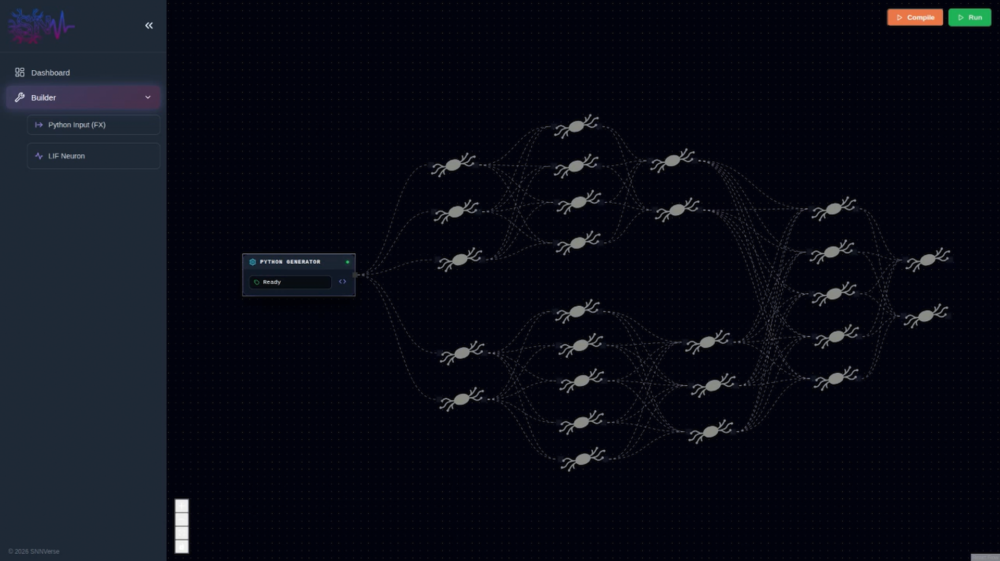

# SNNverse — A Visual Playground for Spiking Neural Networks

SNNverse is an open-source, visual, and interactive playground for quickly building, simulating, and understanding Spiking Neural Networks (SNNs).  
It aims to make SNN prototyping accessible, intuitive, and fast — without sacrificing the computational power needed for real research.

This project integrates a modern web frontend with GPU-accelerated backend simulation through GeNN (GPU Enhanced Neuronal Networks).  
It is designed as a practical tool for students, researchers, and engineers exploring the computational properties of biologically inspired neural models.

---

## Purpose and Motivation

Spiking Neural Networks are an exciting but technically challenging field.  
Existing tools are powerful but often require:

- Complex installation steps  
- Manual coding for every model  
- Sparse visualization options  
- No intuitive way to experiment and iterate  
- Limited or no real-time insight into the dynamics  

SNNverse was created to fill this gap.

### Why this project exists
The goal is to provide:

### 1. **A visual, interactive way to build SNN models**
Users can construct networks via a modern, flow-based interface where neurons, synapses, and parameters can be manipulated directly.

### 2. **Fast experimentation**
The tool enables rapid iteration: change parameters, adjust topologies, test input streams, and immediately see how the dynamics evolve.

### 3. **Real-time simulation feedback**
The system streams membrane voltages, spike activity, and node statistics during simulation, allowing users to observe the behavior of their network as it runs.

### 4. **GPU-accelerated computation through GeNN**
If GPU avaiable, the model will be built to run on it. Otherwise, CPU backend is also supported.

### 5. **An open, extensible platform**
SNNverse is built to be contributed to:
- New neuron models  
- New synapse rules  
- Better visualization  
- New backends  
- Tutorials and examples  

It is intended to grow into a community-driven ecosystem around SNN exploration.

---

## Features

### **Visual Network Construction**
- Drag-and-drop nodes  
- Connect neurons, populations, and synapses  
- Edit parameters via dynamic forms  
- Real-time layout and visual cues

### **Real-Time Simulation Feedback**
- Live membrane voltage visualization  
- Real-time spike raster streams  
- Activity statistics per population  
- Built-in WebSocket streaming interface

### **GeNN Backend Integration**
- Automatic C++ code generation  
- Ready-to-compile project folders  
- GPU-accelerated runtime  
- Optional Python-based runner

### **Modern Frontend**
Built with:
- React  
- React Flow  
- WebSockets  
- Live animation and responsive design  

### **Open Source**
SNNverse is open for:
- Contributions  
- Extensions  
- Research use  
- Educational demonstrations  

---

## Status

The project is under active development.

Planned milestones include:
- Enhanced neuron model support  
- Improved real-time visualization 
- Public demo deployment  

Contributions, discussions, and suggestions are welcome.

---

## Contributing

SNNverse is designed to be open and collaborative.

Ways to contribute:
- Implement new features  
- Improve UI/UX  
- Add examples or tutorials  
- Report bugs  
- Review code  
- Discuss design decisions  

---

## License

This project will be released under a permissive open-source license. 

---

## Contact

If you are interested in collaborating, contributing, or using SNNverse for research purposes, feel free to open an Issue or contact the maintainer directly (`marcos.oriol.p@gmail.com`).

